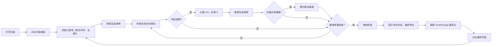

## 1. 产品概述

一款基于 Canvas 的经典贪吃蛇网页游戏，纯前端实现无需后端，打开 `index.html` 即可游玩。目标用户为休闲游戏爱好者，通过方向键控制蛇移动吃食物获得分数，挑战最高分。

## 2. 核心功能

### 2.1 用户角色
无需用户登录，所有访客均可直接游戏。

### 2.2 功能模块
1. **游戏主界面**：Canvas 游戏画布、分数显示、计时器、历史最高分
2. **游戏控制**：方向键控制、开始/重新开始按钮
3. **游戏逻辑**：蛇移动、食物生成、碰撞检测、速度调节
4. **游戏结束**：结束画面、存活时长显示、历史最高分更新

### 2.3 页面详情

| 页面名称 | 模块名称 | 功能描述 |
|-----------|-------------|---------------------|
| 游戏主页面 | 信息面板 | 显示当前分数、存活时长、历史最高分 |
| 游戏主页面 | 游戏画布 | 20×20 网格 Canvas 绘制蛇和食物 |
| 游戏主页面 | 控制按钮 | 开始游戏、重新开始按钮 |
| 游戏结束弹窗 | 结算面板 | 显示最终得分、存活时长、是否打破记录 |

## 3. 核心流程

玩家打开页面 → 点击开始 → 蛇从中间出发向右移动 → 方向键控制蛇移动方向（不可直接反向）→ 吃到食物得分+10，蛇长度+1 → 分数提升速度加快 → 撞墙或撞自身 → 游戏结束 → 显示存活时长和最终得分 → 更新本地最高分 → 可重新开始。

## 4. 用户界面设计

### 4.1 设计风格
采用**霓虹复古像素**风格，深色背景配合荧光色蛇身，营造街机游戏氛围。
- 主色调：深灰背景 `#1a1a2e`，蛇身荧光绿 `#00ff88`，食物霓虹红 `#ff2e63`
- 网格线：淡紫色 `rgba(136, 132, 255, 0.1)`
- 按钮：霓虹发光效果，圆角矩形
- 字体：使用 `Press Start 2P` 像素字体配合 `JetBrains Mono` 等宽字体
- 布局：居中画布，顶部信息栏，底部控制按钮
- 动效：蛇移动平滑过渡，吃食物时闪烁动画，游戏结束抖动效果

### 4.2 页面设计概述

| 页面名称 | 模块名称 | UI 元素 |
|-----------|-------------|-------------|
| 游戏主页面 | 信息面板 | 居上排列，分数/时长/最高分三块，像素字体，霓虹发光 |
| 游戏主页面 | 游戏画布 | 居中显示，20×20 网格，蛇身为渐变绿色块，食物为红色带光晕 |
| 游戏主页面 | 控制区域 | 开始/重新开始按钮，霓虹边框，hover 发光效果 |
| 游戏结束弹窗 | 结算面板 | 半透明黑色背景，居中白色文字，新纪录时有庆祝动画 |

### 4.3 响应性
- 桌面端优先，Canvas 固定尺寸 400×400px（每格 20px）
- 移动端自适应缩放，Canvas 宽度不超过屏幕宽度 90%
- 支持键盘方向键控制，移动端可选虚拟方向键

### 4.4 视觉细节
- 蛇头略大于身体，带眼睛方向指示
- 食物带脉冲光晕动画
- 网格线为虚线，营造复古感
- 游戏结束时画布轻微红色闪烁
