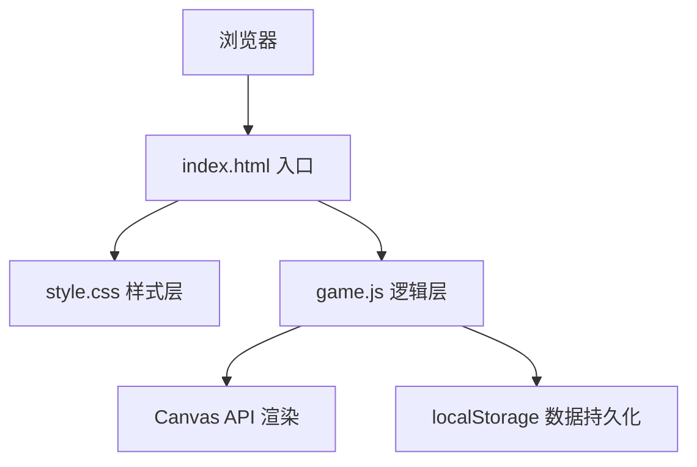

## 1. 架构设计



## 2. 技术描述

- **前端**：原生 HTML5 + CSS3 + JavaScript（ES6+），无任何第三方库
- **渲染技术**：Canvas 2D API
- **数据存储**：浏览器 localStorage（存储历史最高分）
- **文件结构**：
  - `index.html` - 页面结构，Canvas 元素和 UI 容器
  - `style.css` - 游戏样式，霓虹复古风格
  - `game.js` - 游戏核心逻辑（蛇、食物、碰撞检测、渲染循环）

## 3. 核心配置常量

| 常量名 | 值 | 说明 |
|-------|----|------|
| `GRID_SIZE` | 20 | 网格尺寸（20×20 格） |
| `CELL_SIZE` | 20 | 每格像素大小 |
| `INITIAL_SNAKE_LENGTH` | 3 | 蛇初始长度 |
| `SCORE_PER_FOOD` | 10 | 每吃一个食物得分 |
| `SPEED_LEVELS` | `[[0, 200], [50, 150], [100, 100]]` | 速度档位：[分数阈值, 毫秒/格] |

## 4. 核心数据结构

### 4.1 蛇（Snake）
```javascript
{
  body: [{ x: 10, y: 10 }, { x: 9, y: 10 }, { x: 8, y: 10 }], // 身体坐标数组
  direction: { x: 1, y: 0 },  // 当前移动方向
  nextDirection: { x: 1, y: 0 } // 下一帧方向（防止180度反向）
}
```

### 4.2 食物（Food）
```javascript
{
  x: 15,  // 格子坐标 x
  y: 8    // 格子坐标 y
}
```

### 4.3 游戏状态（GameState）
```javascript
{
  score: 0,           // 当前分数
  highScore: 0,       // 历史最高分（从 localStorage 读取）
  startTime: null,    // 游戏开始时间戳
  isRunning: false,   // 游戏是否进行中
  isGameOver: false,  // 是否游戏结束
  currentSpeed: 200   // 当前移动间隔（毫秒）
}
```

## 5. 核心函数定义

| 函数名 | 功能 |
|-------|------|
| `initGame()` | 初始化游戏状态、蛇位置、生成食物 |
| `startGame()` | 开始游戏，记录开始时间，启动游戏循环 |
| `gameLoop()` | 游戏主循环，控制移动间隔 |
| `moveSnake()` | 蛇移动逻辑，碰撞检测，吃食物判定 |
| `changeDirection(newDir)` | 改变方向，防止180度直接反向 |
| `generateFood()` | 在随机空格生成食物 |
| `checkCollision(head)` | 检测撞墙和撞自身 |
| `updateSpeed()` | 根据当前分数更新移动速度 |
| `render()` | Canvas 绘制：网格、蛇、食物 |
| `showGameOver()` | 显示游戏结束画面，计算存活时长 |
| `saveHighScore()` | 保存最高分到 localStorage |
| `formatDuration(ms)` | 格式化毫秒为 "分:秒" 显示 |
